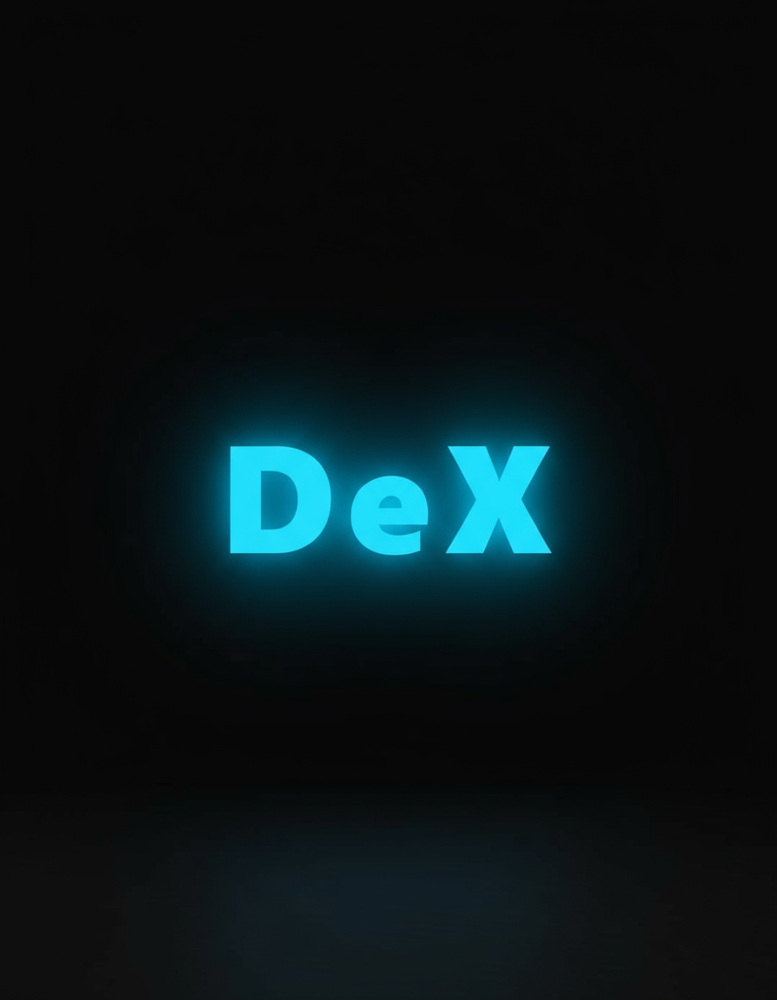

# AimDeX

<div align="center">
  
  
  [](https://opensource.org/licenses/MIT)
  [](https://github.com/Cahpcodes/AimDeX/releases)
  [](https://discord.gg/aimdex)
  
  **A powerful, open-source aim assistance tool**
  
  The next generation successor to Aimmy V2
</div>

---

## 📋 Table of Contents

- [About](#about)
- [Features](#features)
- [Installation](#installation)
- [Usage](#usage)
- [Building from Source](#building-from-source)
- [Documentation](#documentation)
- [Contributing](#contributing)
- [License](#license)
- [Support](#support)

---

## 🎯 About

AimDeX is an open-source aim assistance tool designed with performance, accuracy, and customization in mind. Built as the spiritual successor to Aimmy V2, AimDeX incorporates community feedback and modern best practices to deliver a powerful yet accessible solution.

### Why AimDeX?

- **Open Source**: Fully transparent codebase under MIT License
- **High Performance**: Optimized for minimal resource usage
- **Customizable**: Extensive configuration options
- **Community-Driven**: Built with and for the community
- **Regular Updates**: Active development and maintenance

---

## ✨ Features

- 🎯 **Advanced Detection**: State-of-the-art target detection algorithms
- ⚡ **Low Latency**: Minimal input lag for responsive performance
- 🎨 **Modern UI**: Clean, intuitive interface
- 🔧 **Highly Configurable**: Customize every aspect to your needs
- 🔒 **Secure**: No telemetry or data collection
- 📊 **Statistics Tracking**: Monitor your performance
- 🌐 **Multi-Language Support**: Available in multiple languages
- 🔄 **Auto-Update**: Stay up to date with the latest features

---

## 📥 Installation

### Option 1: Download Pre-built Release (Recommended)

1. Go to the [Releases](https://github.com/Cahpcodes/AimDeX/releases) page
2. Download the latest `AimDeX.exe` from the Assets section
3. Run the executable - no installation required!

### Option 2: Build from Source

See [Building from Source](#building-from-source) section below.

---

## 🚀 Usage

1. Launch `AimDeX.exe`
2. Configure your settings in the Settings tab
3. Select your desired detection model
4. Click "Start" to begin
5. Use your configured hotkey to toggle aim assistance

For detailed usage instructions, see the [Documentation](./docs).

---

## 🛠️ Building from Source

### Prerequisites

- Visual Studio 2022 or later
- .NET 6.0 SDK or later
- Windows 10/11

### Build Steps

```bash
# Clone the repository
git clone https://github.com/Cahpcodes/AimDeX.git
cd AimDeX

# Restore dependencies
dotnet restore

# Build the project
dotnet build --configuration Release

# Run the application
dotnet run --project src/AimDeX/AimDeX.csproj
```

The compiled executable will be located in `src/AimDeX/bin/Release/net6.0/`

---

## 📚 Documentation

Comprehensive documentation is available in the [`/docs`](./docs) folder:

- [Getting Started Guide](./docs/getting-started.md)
- [Configuration Options](./docs/configuration.md)
- [Troubleshooting](./docs/troubleshooting.md)
- [API Reference](./docs/api-reference.md)
- [Contributing Guide](./docs/contributing.md)

---

## 🤝 Contributing

We welcome contributions from the community! Whether it's:

- 🐛 Bug reports
- 💡 Feature requests
- 📝 Documentation improvements
- 🔧 Code contributions

Please read our [Contributing Guide](./docs/contributing.md) before submitting a pull request.

### Development Guidelines

- Follow the existing code style
- Write clear commit messages
- Add tests for new features
- Update documentation as needed

---

## 📦 Releases

To upload a new release:

1. Build your project in **Release** configuration
2. Navigate to the [Releases](https://github.com/Cahpcodes/AimDeX/releases) page
3. Click "Draft a new release"
4. Create a new tag (e.g., `v1.0.0`)
5. Upload the compiled `AimDeX.exe` file in the Assets section
6. Add release notes describing changes and new features
7. Click "Publish release"

**Note**: Always test the executable thoroughly before publishing a release.

---

## 📄 License

This project is licensed under the MIT License - see the [LICENSE](LICENSE) file for details.

You are free to:
- ✅ Use commercially
- ✅ Modify
- ✅ Distribute
- ✅ Private use

---

## 💬 Support

Need help? Have questions?

- 📫 [Open an Issue](https://github.com/Cahpcodes/AimDeX/issues)
- 💬 [Join our Discord](https://discord.gg/aimdex)
- 📖 [Read the Documentation](./docs)

---

## 🌟 Acknowledgments

- Inspired by Aimmy V2 and the community around it
- Thanks to all contributors who help make this project better
- Special thanks to the open-source community

---

## ⚠️ Disclaimer

This software is provided for educational and research purposes only. Users are responsible for ensuring their use complies with the terms of service of any games or applications they use it with. The developers assume no liability for misuse.

---

<div align="center">
  Made with ❤️ by the AimDeX Team
  
  ⭐ Star us on GitHub — it helps!
</div>
